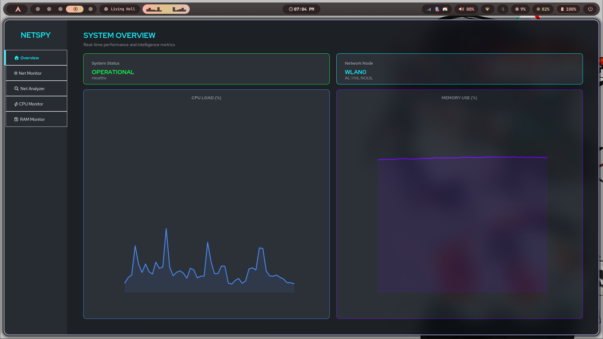
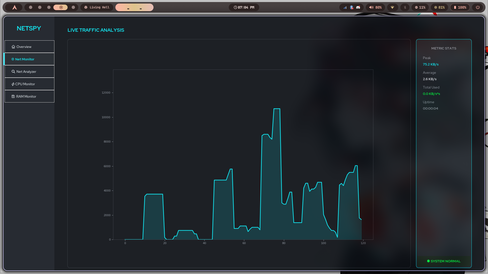
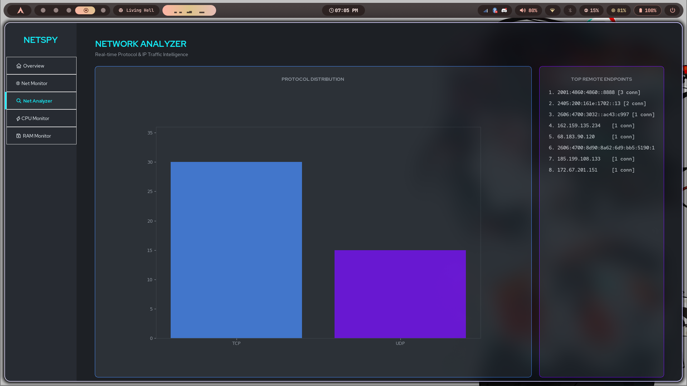
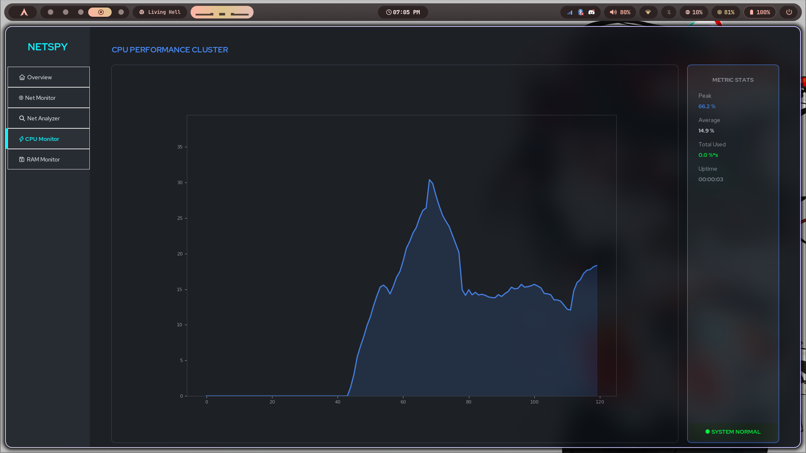
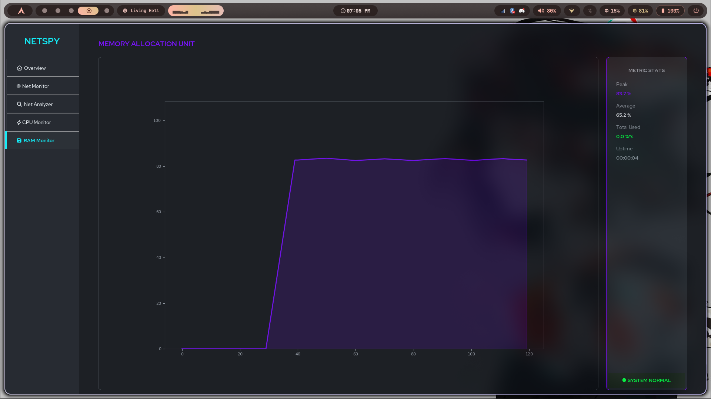

# 🕵️‍♂️ netspy — Advanced AI-Driven System Telemetry


`netspy` is a futuristic, high-performance system monitoring dashboard that leverages **Machine Learning (Isolation Forests)** to detect and alert you to anomalous spikes in Network, CPU, and RAM usage in real-time. Built with a sleek "Cyberpunk Dark" aesthetic, it transforms raw system metrics into actionable intelligence.

---

## 📸 Dashboard Gallery

<p align="center">
  
  
</p>
<p align="center">
  
  
</p>
<p align="center">
  
</p>

---

## 🚀 Key Features

### 1. 🧠 AI-Powered Anomaly Detection
Unlike traditional monitors that use fixed thresholds (e.g., "alert at 90%"), `netspy` uses an **Ensemble of Decision Trees (Isolation Forest)** to learn your system's "normal" behavior.
*   **Multi-Dimensional Analysis**: Evaluates raw values, velocity (rate of change), and trend-deviance.
*   **Adaptive Learning**: The models retrain themselves every 60 seconds to adapt to your current workflow.
*   **Persistent Intelligence**: Trained models are cached using `pickle` (platform-aware: `.cache/netspy` on Linux, `AppData` on Windows) to stay smart across restarts.

### 2. ⚡ High-Resolution "60 FPS" Visualizers
Experience fluid, real-time telemetry with custom-tuned Matplotlib integration.
*   **Liquid Smooth Graphs**: 40ms update cycles (~25-30 FPS) with a 120-point high-resolution buffer.
*   **Neon Area Fills**: Dynamic glowing fills that change color (Cyan to Anomaly Red) based on AI predictions.
*   **Data Smoothing**: Simple Moving Average (SMA) filtering to eliminate "jitter" while preserving spike detection.

### 3. 🔍 Real-Time Network Intelligence
A dedicated analyzer module that goes beyond simple bandwidth tracking:
*   **Protocol Distribution**: Visualizes TCP vs. UDP traffic ratios using live bar charts.
*   **Top Remote Endpoints**: Ranks the top 8 IP addresses your device is communicating with.
*   **Active Node Detection**: Automatically identifies and tracks the primary active network interface (WLAN, Ethernet, etc.).

### 4. 🎨 Futuristic "Cyberpunk" Dashboard
A bespoke UI built for clarity and impact:
*   **Rounded Geometry**: Custom-engineered `RoundedFrame` components for a modern, hardware-appliance look.
*   **Sidebar Navigation**: Seamlessly switch between **System Overview**, **Network**, **CPU**, and **RAM** clusters.
*   **Session Stats**: Tracks Peak Speed, Average Load, Total Data Consumed, and Session Uptime.

---

## 🛠 Architecture

The project follows a strict modular architecture for scalability:

*   **`main.py`**: The lightweight entry point.
*   **`src/core/monitor.py`**: The "Brain." Handles `psutil` data gathering, feature engineering, and the AI training/prediction pipeline.
*   **`src/ui/`**:
    *   `dashboard.py`: Main container and navigation controller.
    *   `styles.py`: Centralized theme engine (colors, fonts, radii).
    *   `components/`: Reusable widgets like the `Sidebar` and `RoundedFrame`.
    *   `views/`: Feature-specific screens (Home, Network, CPU, RAM, Analyzer).

---

## 📥 Installation & Setup

### Prerequisites
*   Python 3.12+
*   Pip (Python package manager)

### Installation
1.  **Clone the repository**:
    ```bash
    git clone https://github.com/youruser/netspy.git
    cd netspy
    ```
2.  **Install dependencies**:
    ```bash
    pip install -r requirements.txt
    ```

### Running the App
```bash
python main.py
```

---

## ⚙️ How the AI Works

The `AIResourceMonitor` doesn't just watch the numbers; it extracts a 3-feature vector for every step:
1.  **Current Value ($x$):** The raw metric.
2.  **Velocity ($\Delta x$):** How fast the value is rising or falling.
3.  **Trend ($x - \bar{x}$):** How far the current value is from the 60-second moving average.

These features are fed into an **Isolation Forest**. In high-dimensional space, "normal" points cluster together. Anomalies (spikes) are easily "isolated" by the trees, allowing the system to flag them instantly.

---

## 🛡 License
Distributed under the MIT License. See `LICENSE` for more information.
